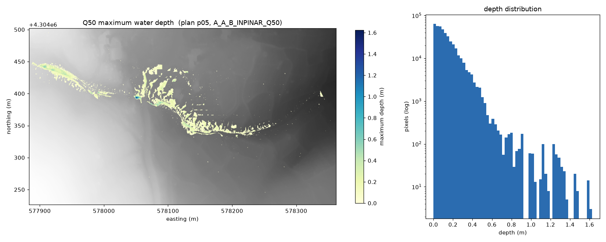

# Q50 Maksimum Su Derinliği Haritası

HEC-RAS projesindeki **Q50 senaryosunu otomatik bulan**, planı HEC-RAS ile
**çalıştıran** ve gerçek sonuçlardan **`OUTPUT/q50_depth.tif`** üreten Python
uygulaması.

```
python main.py --project "D:/CASE_DATA" --ras-dir "C:/Program Files (x86)/HEC/HEC-RAS/6.6"
```

Plan numarası kodda yazılı değildir, kullanıcıya sorulmaz; senaryo etiketinden
türetilir. Orijinal proje klasörüne yazılmaz. Koordinat sistemi ve arazi,
sonuç dosyasının kendi içinden okunur.

---

## Belgedeki maddelerin karşılığı

Case study belgesinin her maddesi ve bu depodaki karşılığı.

### 3. Beklenen uygulama davranışı

| Belge | Karşılığı |
| --- | --- |
| Kullanıcıdan **proje klasörünü** alabilmeli | `--project` |
| Kullanıcıdan **HEC-RAS kurulum dizinini** alabilmeli | `--ras-dir` (klasör ya da doğrudan `Ras.exe`) |
| Q50 **otomatik** belirlenmeli, plan numarası seçtirilmemeli | `q50depth/project.py` — `.prj`'deki plan listesi + sınır kontrollü kalıp. Hiçbir yerde soru sorulmaz. |
| Harita **proje sonuçları kullanılarak** üretilmeli | `p05.hdf` içindeki `Maximum Water Surface` + model arazisi |
| `OUTPUT` klasörüne `q50_depth.tif` adıyla yazılmalı | Varsayılan çıktı yolu: `OUTPUT/q50_depth.tif` |
| Başarı ve başarısızlık için **anlaşılır durum bilgisi** | Adım adım konsol çıktısı; hata sınıfı başına ayrı çıkış kodu ve ipucu |
| **Kontrolsüz kapanma olmamalı** | Beklenen her hata `Q50Error`; yığın izi yalnızca gerçek bug'da. `tests/test_cli.py` bunu sınar. |

### 4. Kısıtlar

| Kısıt | Nasıl karşılandı |
| --- | --- |
| **Otomatik seçim** — Q50 koda gömülmeyecek, seçtirilmeyecek | Plan numarası (`p05`) kodun hiçbir yerinde geçmez; senaryo etiketi `--scenario` parametresidir, varsayılanı `Q50`'dir. Etiketten plana giden yol her çalıştırmada projeden yeniden türetilir. |
| **Gerçek üretim** — hazır raster kopyalanmayacak | Raster her seferinde sonuç HDF'inden hesaplanır. Klasördeki hiçbir `.tif` kopyalanmaz: veri setindeki yedi `.tif` tarandı, dördü arazi kotu (~1374 m), biri arazi örtüsü sınıf kodu (2–8), ikisi boş — **hazır bir derinlik rasteri yok**, belgenin dediği gibi. GeoTIFF etiketi `HEC_RAS_EXECUTED` HEC-RAS'ın gerçekten çalışıp çalışmadığını kaydeder. |
| **Taşınabilirlik** — yollar gömülmeyecek | Tüm yollar argüman. Kodda sabit yol yok; yalnızca yardım metinlerinde örnek yol geçer. |
| **Kaynak bütünlüğü** — orijinal dosyalar değişmeyecek | Proje `workspace/` altına kopyalanır, hesap orada yapılır. Ayrıca kaynak klasörün parmak izi öncesi/sonrası karşılaştırılıp rapor edilir (`--integrity full` ile SHA-256). |
| **Tekrarlanabilirlik** | Bu README'deki kurulum + tek komut. Ölçülen sayılar `docs/WINDOWS-DOGRULAMA.md` içinde referans olarak yazılı. |

### 5. Teslimatlar

| Teslim kalemi | Dosya |
| --- | --- |
| Kaynak kod | `main.py`, `q50depth/` (14 modül), `tools/preview.py`, `tools/audit_project.py` |
| Çıktı | [`OUTPUT/q50_depth.tif`](OUTPUT/q50_depth.tif) — bkz. aşağıdaki not |
| Bağımlılıklar | `requirements.txt`, `requirements-windows.txt`, `requirements-dev.txt` |
| README | bu dosya |
| Çalışma kaydı | [`docs/ornek-calisma-kaydi.txt`](docs/ornek-calisma-kaydi.txt) ve her çalıştırmada yazılan `OUTPUT/run.log` |

> **Depodaki `OUTPUT/q50_depth.tif` hakkında.** Bu dosya, projede hazır duran
> `p05.hdf` sonuçlarından üretilmiştir (`--use-existing-results`); geliştirme
> makinesinde HEC-RAS bulunmadığı için hesap adımı orada çalıştırılamadı.
> **Hazır bir raster kopyalanmamıştır** — dosya her seferinde HEC-RAS'ın kendi
> sonuçlarından hesaplanır. HEC-RAS 6.6 kurulu Windows makinesinde tek komutla
> yeniden üretilir ve o çıktı bunun yerini alır; GeoTIFF'in `HEC_RAS_EXECUTED`
> etiketi hangisinin elinizde olduğunu söyler.

### 6. Teknik açıklama beklentisi

| Belge sorusu | Bölüm |
| --- | --- |
| Q50 senaryosunu nasıl belirlediniz | [Q50 senaryosunu nasıl belirledim](#q50-senaryosunu-nasıl-belirledim) |
| HEC-RAS ile nasıl etkileşim kurdunuz | [HEC-RAS ile nasıl etkileşim kuruyorum](#hec-ras-ile-nasıl-etkileşim-kuruyorum) |
| Rasterın doğru senaryoya ait olduğunu nasıl kontrol ettiniz | [Çıktının doğru senaryoya ait olduğunu nasıl doğruluyorum](#çıktının-doğru-senaryoya-ait-olduğunu-nasıl-doğruluyorum) |
| Hata durumlarını nasıl yönettiniz | [Hata yönetimi](#hata-yönetimi) |

### 7. Yapay zekâ kullanımı

Beyan: [`docs/AI-KULLANIMI.md`](docs/AI-KULLANIMI.md).

---

## İçindekiler

- [Belgedeki maddelerin karşılığı](#belgedeki-maddelerin-karşılığı)
- [Kurulum](#kurulum)
- [Kullanım](#kullanım)
- [Nasıl çalışıyor](#nasıl-çalışıyor)
- [Q50 senaryosunu nasıl belirledim](#q50-senaryosunu-nasıl-belirledim)
- [HEC-RAS ile nasıl etkileşim kuruyorum](#hec-ras-ile-nasıl-etkileşim-kuruyorum)
- [Derinliği nasıl hesaplıyorum](#derinliği-nasıl-hesaplıyorum)
- [Çıktının doğru senaryoya ait olduğunu nasıl doğruluyorum](#çıktının-doğru-senaryoya-ait-olduğunu-nasıl-doğruluyorum)
- [Hata yönetimi](#hata-yönetimi)
- [Testler](#testler)
- [Bilinen sınırlamalar](#bilinen-sınırlamalar)
- [Yapay zekâ kullanımı](#yapay-zekâ-kullanımı)

---

## Kurulum

Python 3.10+ gerekir. **Windows'ta 3.13 veya 3.14 kullanın**: bağımlılık
ağacının tamamı (41 paket) bu iki sürümde hazır `win_amd64` tekerleği olarak
iner, hiçbir şey derlenmez — kontrol edildi. 3.12 artık güvenlik sürümlerinde
olduğu için python.org Windows installer'ı yayınlamıyor.

**Windows (tam çalışma — HEC-RAS'ı da çalıştırır):**

```bat
python -m venv .venv
.venv\Scripts\activate.bat
python -m pip install --upgrade pip
pip install -r requirements-windows.txt
```

Testleri ve `tools/preview.py`'yi de çalıştıracaksanız:
`pip install -r requirements-dev.txt`

`-r` şart: proje bir paket olarak kurulmak zorunda değil, `python main.py` ile
çalışır. İsterseniz paket olarak da kurulabilir — `pip install -e ".[windows]"` —
o zaman `q50depth` komutu da kullanılabilir hale gelir.

**macOS / Linux (yalnız sonuç işleme — HEC-RAS bu platformlarda yok):**

```bash
python3 -m venv .venv
source .venv/bin/activate
pip install -r requirements.txt
```

`requirements.txt` çekirdek boru hattını kurar (`h5py`, `numpy`, `rasterio`).
`requirements-windows.txt` buna HEC-RAS'ı süren `ras-commander` kütüphanesini
ekler. Ayrıca **HEC-RAS 6.6 kurulu olmalıdır**; uygulama kurulum dizinini
`--ras-dir` ile alır, kendisi kurmaz.

## Kullanım

```
python main.py --project PATH [--ras-dir PATH] [seçenekler]
```

| Argüman | Ne işe yarar |
| --- | --- |
| `--project PATH` | HEC-RAS proje klasörü. `CASE_DATA` kökünü verebilirsiniz; içindeki `.prj` aranarak bulunur. |
| `--ras-dir PATH` | HEC-RAS kurulum klasörü veya doğrudan `Ras.exe` yolu. `--use-existing-results` verilmediyse zorunlu. |
| `--output PATH` | Çıktı GeoTIFF. Varsayılan `OUTPUT/q50_depth.tif`. |
| `--scenario Qnnn` | Aranacak tekerrür etiketi. Varsayılan `Q50`. |
| `--workspace PATH` | Projenin kopyalanacağı çalışma dizini. Varsayılan `workspace/`. |
| `--use-existing-results` | HEC-RAS'ı çalıştırmaz, projede hazır duran sonuçları okur. Geliştirme ve yeniden üretim içindir. |
| `--trim-project {auto,always,never}` | Çalışma kopyasındaki proje dosyasını seçilen plana indirger. `auto` (varsayılan) bunu yalnızca projedeki *başka* bir plan bozuksa yapar. |
| `--geometry {auto,rasprocess,harvest,none}` | Teslimde eksik olan ön işlenmiş geometri tablolarının nasıl sağlanacağı. `auto` (varsayılan) önce HEC-RAS'ın kendi `RasProcess.exe` aracına yazdırır, olmazsa teslim edilen sonuç dosyasındaki eksiksiz geometriden alır. |
| `--inflow {dss,inline}` | Sınır koşulu hidrografının kaynağı. `dss` (varsayılan) modeli kendi DSS dosyasını okumaya bırakır. `inline` seriyi projedeki DSS metin dökümünden okuyup çalışma kopyasının akış dosyasına gömer; koşu artık DSS'e bağlı olmaz. |
| `--rasmapper {off,on}` | HEC-RAS hesap sonrası RASMapper'ın hazır harita üretimini çalıştırsın mı. Varsayılan `off`: rasteri zaten biz üretiyoruz ve teslim edilen RASMapper yapılandırması paketten çıkarılmış katmanlara bakıyor. |
| `--prepare-only` | Çalışma kopyasını hazırlayıp durur (kopyala, yolları onar, projeyi indirge). HEC-RAS arayüzünde elle incelemek için. |
| `--runner {cmdr,controller}` | HEC-RAS'ın sürülme yolu. Varsayılan `cmdr`. |
| `--cores N` | HEC-RAS'ın kullanacağı çekirdek sayısı. |
| `--resolution METRE` | Çıktı piksel boyutu. Varsayılan: arazinin kendi çözünürlüğü (bu veri setinde 0.1 m). |
| `--min-depth METRE` | Bu değerin altındaki derinlikler nodata olur. Varsayılan 0.0. |
| `--integrity {fast,full,off}` | Kaynak verinin değişmediğinin nasıl kanıtlanacağı. Varsayılan `fast`. |
| `--no-verify` | Senaryo doğrulamalarını raporlar ama başarısızlıkta durmaz. |
| `--log PATH`, `--verbose` | Çalışma kaydı ve ayrıntılı konsol. |

**Tipik teslim çalıştırması (Windows):**

```bat
python main.py ^
  --project "D:\CASE_DATA" ^
  --ras-dir "C:\Program Files (x86)\HEC\HEC-RAS\6.6" ^
  --output OUTPUT\q50_depth.tif
```

**Sonucu gözle kontrol etmek:**

```bash
pip install -r requirements-dev.txt
python tools/preview.py OUTPUT/q50_depth.tif \
  --terrain "CASE_DATA/AKA_AFY_BAY_INPINAR_1/1_Modeller/merge.Clone.vrt"
```



Örnek konsol çıktısı: [`docs/ornek-calisma-kaydi.txt`](docs/ornek-calisma-kaydi.txt).
Her çalıştırma ayrıca `OUTPUT/run.log` dosyasını yazar.

## Nasıl çalışıyor

```
1. Proje bul          .prj dosyalarını tara, içinde "Plan File=" geçeni seç
2. Senaryoyu çöz      plan listesini .prj'den oku, Q50 ile tam olarak bir plan eşleşsin
3. Çalışma kopyası    projeyi workspace/ altına kopyala (orijinale yazılmaz)
4. Hesapla            HEC-RAS ile planı çalıştır (ras-commander)
5. Derinliği kur      sonuç HDF5 + arazi -> maksimum derinlik ızgarası
6. Doğrula ve yaz     senaryo kontrolleri, sonra GeoTIFF
```

Modüller:

| Dosya | Sorumluluk |
| --- | --- |
| `q50depth/project.py` | `.prj` bulma, plan listesi, senaryo eşleştirme |
| `q50depth/workspace.py` | Çalışma kopyası ve kaynak bütünlüğü kanıtı |
| `q50depth/compute.py` | HEC-RAS'ın çalıştırılması (tek Windows bağımlı yer) |
| `q50depth/results.py` | Sonuç HDF5'inin okunması |
| `q50depth/terrain.py` | Arazi katmanı ve kot değişiklikleri |
| `q50depth/depth.py` | Su yüzeyi − arazi = derinlik ızgarası |
| `q50depth/raster.py` | GeoTIFF yazımı ve künye etiketleri |
| `q50depth/verify.py` | Çıktı ile senaryo arasındaki bağın kontrolü |
| `q50depth/cli.py` | Argümanlar, akış, günlük |
| `q50depth/errors.py` | Hata sınıfları ve çıkış kodları |
| `q50depth/references.py` | Planın dışarıdan okuduğu dosyalar ve onarımı |
| `q50depth/hydrograph.py` | DSS metin dökümünden sınır koşulu serisi |
| `q50depth/geometry.py` | Eksik ön işlenmiş geometri tablolarının onarımı |
| `q50depth/logging_setup.py` | Konsol ve dosya günlüğü |

## Q50 senaryosunu nasıl belirledim

Projede yedi plan var ve ikisi tuzak.

| Plan | Plan Title | Short Identifier |
| --- | --- | --- |
| p01 | A_A_B_INPNAR_STEADY | A_A_B_INPINAR_STEADY |
| p02 | A_A_B_INPINAR_STEADY | A_A_B_INPINAR |
| p03 | A_A_B_INPINAR_UNSTEADY_2D | INPINAR_**Q500**_UNSTEADY |
| p04 | A_A_B_INPINAR_**Q500** | A_A_B_INPINAR_**Q500** |
| **p05** | **A_A_B_INPINAR_Q50** | **Q50** |
| p06 | A_A_B_INPINAR_Q100 | Q100 |
| p07 | A_A_B_INPINAR_Q1000 | Q1000 |

**Tuzak 1 — alt dize.** `"Q50" in başlık` yazarsanız p03 ve p04 de eşleşir,
çünkü `"Q50"` dizisi `"Q500"` metninin içinde geçer. Çözüm, Q50'nin iki
yanında rakam olmamasını şart koşan sınır kontrollü bir kalıp:

```python
(?<![0-9])[Qq]0*50(?![0-9])
```

`(?<![0-9])` öncesinde, `(?![0-9])` sonrasında rakam istemez; `0*` ise `Q050`
gibi sıfır dolgulu yazımı kabul eder. Bu kalıp `Q50` ve `Q050` ile eşleşir,
`Q500`, `Q5000`, `Q100`, `Q1000` ile eşleşmez. Yedi planın tamamında test
edilmiştir (`tests/test_project.py`).

**Tuzak 2 — listede olmayan plan dosyası.** Aynı klasörde `Backup.p01` adlı
bir dosya duruyor; `Plan Title=A_A_B_INPINAR_Q50`, `Short Identifier=Q50`.
Yani **tam eşleşme**. Klasörü `*.p??` ile tarayan kod iki sonuç bulur ve
hangisinin doğru olduğunu bilemez.

Çözüm, plan listesini klasör taramasıyla değil **`A_A_B_INPINAR.prj` içindeki
`Plan File=` satırlarından** almaktır. Proje dosyası yalnızca p01–p07'yi
listeler; `Backup.p01` orada yoktur, dolayısıyla hiç değerlendirmeye girmez.

`.prj` dosyasında ayrıca `Current Plan=p05` yazıyor. Bunu **seçim ölçütü
olarak kullanmadım** — belge otomatik belirlemeyi istiyor, `Current Plan` ise
projeyi en son kimin nasıl kapattığına bağlı. Yalnızca çalışma kaydına
"seçimle uyuşuyor" notu olarak düşülür.

Sıfır eşleşme ve birden fazla eşleşme ayrı ayrı hata verir; hiçbir durumda
"ilkini al" davranışı yoktur. Nitekim bu projede `--scenario Q500` iki planla
eşleştiği için bilinçli olarak reddedilir.

## HEC-RAS ile nasıl etkileşim kuruyorum

HEC-RAS bir Windows programıdır ve tek Windows bağımlı adım budur; bu yüzden
`q50depth/compute.py` içinde tek bir fonksiyona hapsedilmiştir. Sürüş,
belgenin de önerdiği **`ras-commander`** kütüphanesi üzerinden yapılır — belge
dışı komut satırı anahtarı uydurulmamıştır. İki yol vardır:

| `--runner` | Çağrı | Ne yapar |
| --- | --- | --- |
| `cmdr` (varsayılan) | `RasCmdr.compute_plan(...)` | HEC-RAS'ın komut satırı çalıştırıcısını kullanır |
| `controller` | `RasControl.run_plan(...)` | `RAS66.HECRASController` COM otomasyon nesnesini sürer — GUI'nin kullandığı arayüz |

`--ras-dir` hem kurulum klasörünü hem doğrudan `Ras.exe` yolunu kabul eder,
böylece standart dışı kurulumlar da çalışır. Yol koda gömülü değildir.

### Teslim edilen proje olduğu gibi çalışmıyor

Bu, case study'nin en çok vakit alan kısmıydı ve belgenin "adayın proje
yapısını incelemesi ve gerekli dosya ilişkilerini kendisinin belirlemesi
beklenmektedir" cümlesinin karşılığı. Tam denetim:
[`docs/VERI-DENETIMI.md`](docs/VERI-DENETIMI.md) — `tools/audit_project.py`
üretiyor.

**Yedi planın beşi yüklenemiyor.**

| Plan | Sorun |
| --- | --- |
| p03 | `Flow File=u01` diyor; dosya diskte var ama `.prj` onu akış dosyaları arasında saymıyor |
| p04 | Giriş debisi `..\..\akarcay_debi.dss` — proje klasörünün iki üstü, teslim paketinin dışı |
| p05 | Giriş debisi `.\_CBS\akarcay_debiler\akarcay_debi.dss` — klasörün diskteki adı `2_CBS` |
| p06 | Aynı `_CBS` sorunu |
| p07 | Aynı `_CBS` sorunu |

Dört akış dosyasının hiçbirinde hidrograf gömülü değil (`Flow Hydrograph= 0`),
yani DSS bulunmadan bu senaryolar hesaplanamaz.

**Neden hepsi bizi ilgilendiriyor:** HEC-RAS bir projeyi açarken *bildirilen
bütün planları* yükler. Beş plan yüklenemeyince tek bir "Error in Loading Plan
Data" kutusu bütün açılışı düşürüyor — p05 kendi başına tutarlı olduğu halde.
Komut satırından çalıştırıldığında daha da sinsi: çalıştırıcı yine "başarılı"
raporluyor ve geriye **yarım bir `p05.hdf`** kalıyor.

**Uygulama çalışma kopyasında sırayla şunları yapıyor** (hepsi loga yazılıyor):

```
[4/6] prepare     repairing 2 unresolved path(s)
      .\_CBS\akarcay_debiler\akarcay_debi.dss -> copied into place from 2_CBS\akarcay_debiler\akarcay_debi.dss
      .\Q50\Q50.dss -> created output folder
      4 unrelated plan(s) in this project cannot be loaded by HEC-RAS;
      reducing the working copy to the selected plan
      A_A_B_INPINAR.prj now declares only p05, g03, u05 (16 declarations removed)
      removed the previous results file from the working copy
```

1. **Çözülmeyen giriş dosyasını yerine koyar.** Proje ağacında aynı adlı dosya
   aranır; **tam bir tane** bulunursa modelin beklediği yola kopyalanır. Hiç ya
   da birden fazla aday varsa tahmin yürütmez, anlamlı hatayla durur — yanlış
   hidrografla hesaplanmış bir taşkın haritası, hesaplanmamış olmasından kötüdür.
2. **Çıktı DSS klasörünü oluşturur.** HEC-RAS dosyayı kendi yazar ama klasörü
   yaratmaz.
3. **Proje dosyasındaki plan listesini seçilen plana indirger.** Diğer planlar,
   açılamayan senaryo klasörlerine bakan DSS girdileri ve `DSS File=dss` gibi
   bozuk satırlar çıkarılır. **Geometri ve akış bildirimleri olduğu gibi
   bırakılır** — HEC-RAS ön işlemci çıktı dosyasını (`.xNN`) projenin geometri
   listesinden numaralandırıyor, liste kısalınca teslimde hiç bulunmayan bir
   dosyayı arıyor ve *"Geometry preprocessor output file was not found ...
   A_A_B_INPINAR.X04"* diyaloğunu açıp tabloları baştan kuruyor. Geri kalan her
   ayar olduğu gibi kalır. Bu adım varsayılan olarak **yalnızca başka bir plan
   bozuksa** yapılır (`--trim-project auto`); sağlıklı bir projeye dokunulmaz.
4. **RASMapper'ın hazır harita üretimini kapatır** (`Run RASMapper=-1` → `0`).
   Rasteri bu uygulama üretiyor; RASMapper'ın işi çıktımıza bir şey katmıyor,
   buna karşılık `.rasmap` içindeki 10 katman referansı çözülmüyor. Açmak için
   `--rasmapper on`.
5. **Önceki koşumdan kalan sonuç dosyasını siler**, yarım bir HDF yeni koşuyu
   kirletmesin diye.

#### Motorun çöküşü: eksik geometri tabloları

Yukarıdakiler yapıldıktan sonra HEC-RAS geometriyi işledi ama motor hemen çöktü:

```
Performing Unsteady Flow Simulation  HEC-RAS 6.6 September 2024
forrtl: severe (157): Program Exception - access violation
RasUnsteady.exe   READ_UN_HDF_STRUC   330   Read_UN_HDF_STRUC_GRP.for
RasUnsteady.exe   SNETREAL2           179   Snetreal2.for
RasUnsteady.exe   UNET_START          144   Unet_start.for
Error with program: RasUnsteady.exe  Exit Code = 157
```

`READ_UN_HDF_STRUC`, motorun **yapı tablolarını** okuduğu yer. Teslim edilen
geometri dosyalarında o tablolar yok:

| Grup | `g03.hdf` (teslim) | `p05.hdf` (başarılı koşu) |
| --- | --- | --- |
| `Geometry/Structures` | ✅ | ✅ |
| `Geometry/Structures/Property Tables` | ❌ | ✅ |
| `Geometry/GeomPreprocess` | ❌ | ✅ |
| `Geometry/Cross Sections` | ❌ | ✅ |

Geometri ön işlemcisini yeniden çalıştırmak çözmüyor — o yalnızca 2D akış alanı
tablolarını üretiyor (*"Computing 2D Flow Area 'inpinar' tables"*), yapı
tablolarına dokunmuyor. Bu yüzden `Run HTab=-1` ile her koşu aynı yere düşüyor.

**Doğru çözüm: tabloları HEC-RAS'a ürettirmek.** HEC-RAS'ın ayrı bir aracı var:

```
RasProcess.exe CompleteGeometry <geom.hdf> RasMapFilename=<proje.rasmap>
```

Bu, RASMapper'ın *Compute Geometry* işleminin GUI'siz karşılığı ve depolama
alanı/yapı bağlantılarını ve 2D özellik tablolarını yazıyor — üstelik HEC-RAS'ın
kontrol ettiği **kaynak veri özetleriyle (source data hash)** damgalayarak, yani
sonraki koşuda "güncel" sayılıyor ve yeniden kurulmuyor. Uygulama bunu
`--ras-dir` içinde bulup çalıştırıyor. Aracın kendi başarı bayrağına
güvenilmiyor (o 1D nehir kenar çizgilerini de arıyor, bu modelde yoklar);
**sonuç dosyaya bakılarak doğrulanıyor**: tablolar geldi mi, gelmedi mi.

**Yedek yol:** `RasProcess.exe` bulunamazsa ya da tabloları yazamazsa, tablolar
teslim edilen `p05.hdf` içindeki eksiksiz `Geometry` grubundan alınıp çalışma
kopyasının `g03.hdf` dosyasına yazılıyor (geometri dosyasının kendi kök
öznitelikleri korunur). Bu yolla gelen tablolarda kaynak veri özeti olmadığı
için ayrıca `Run HTab=-1 → 0` yapılıyor; yoksa ön işlemci onları tekrar siler.

`--geometry rasprocess` / `harvest` / `none` ile hangi yolun kullanılacağı
zorlanabilir.

**Arazi zaman damgası** da hizalanıyor: geometri `Terrain File Date` kaydediyor
ve HEC-RAS bunu arazi dosyasının değiştirilme zamanıyla karşılaştırıyor. Proje
başka makineye kopyalanınca bu tutmuyor, HEC-RAS *"Associated terrain has been
updated"* deyip tabloları yeniden kuruyor.

```
A_A_B_INPINAR.g03.hdf is missing 2 preprocessed group(s) the unsteady engine reads on start-up
A_A_B_INPINAR.g03.hdf rebuilt from A_A_B_INPINAR.p05.hdf (added Geometry/Structures/Property Tables, Geometry/GeomPreprocess)
set the terrain file's timestamp to the one the geometry records (10JUN2026 17:49:26)
told HEC-RAS not to re-run the geometry preprocessor (Run HTab -1 -> 0); it would drop those tables again
```


#### Hidrografı gömme

Q50 akış dosyasında hidrograf gömülü değil (`Flow Hydrograph= 0`); veri
DSS'ten geliyor. Başarılı orijinal koşunun sonucunda seri duruyor:
`Event Conditions/Unsteady/Boundary Conditions/Flow Hydrographs/2D: inpinar
BCLine: inflow`, shape `(15, 2)`.

`--inflow inline` bu bağımlılığı tamamen kaldırır. Projede DSS'in DssVue metin
dökümü de var (`akarcay_debi.txt`); seri oradan okunup çalışma kopyasının akış
dosyasına yazılır:

```
Interval=1HOUR                 ->  Interval=5MIN
Flow Hydrograph= 0             ->  Flow Hydrograph= 15
DSS File=.\_CBS\...\akarcay_debi.dss  ->  DSS File=
Use DSS=True                   ->  Use DSS=False
```

Değerler: 15 ordinat, 5 dakika aralık, tepe **1.69 m³/s**, 02May2025
01:00–02:10 — simülasyon penceresiyle ve orijinal sonuçtaki 15 zaman adımıyla
birebir. Sabit genişlikli tablo formatını bu proje yazmıyor;
`ras-commander`'ın `RasUnsteady.set_boundary_inline_hydrograph()` fonksiyonu
yazıyor, dolayısıyla format tahmin edilmiş değil.

Seri, DSS yol adının A, B, C ve F parçalarıyla eşleştirilir; D (tarih bloğu) ve
E (aralık) parçaları model dosyasıyla dökümde farklı yazıldığı için
karşılaştırmaya girmez (`02May2025/5Minute` ↔ `02MAY2025/5MIN`). Sıfır ya da
birden fazla eşleşmede tahmin yürütülmez.

Hesap bittikten sonra sonuç dosyası ayrıca **doğrulanır**: `Plan Data` ve
`Results` grupları yoksa uygulama durur ve HEC-RAS'ın kendi hesap günlüğünün
(`*.bco05`) son satırlarını hata mesajına ekler. Çalıştırıcının "başarılı"
demesi tek başına yeterli sayılmaz.

Bu onarımların hiçbiri `CASE_DATA`'ya dokunmaz.

**Orijinal veri korunur.** HEC-RAS bir planı çalıştırdığında proje klasörüne
yazar (`.bco`, `.O0X`, `.r0X`, plan HDF'i güncellenir). Bu yüzden uygulama
proje ağacını önce `workspace/` altına kopyalar ve hesabı orada yapar. Bunun
gerçekten böyle olduğu ayrıca **kanıtlanır**: çalışma başında ve sonunda
kaynak klasörün parmak izi çıkarılıp karşılaştırılır ve sonuç çalışma kaydına
yazılır (`--integrity fast|full|off`).

## Derinliği nasıl hesaplıyorum

**HEC-RAS hazır bir maksimum derinlik veri seti üretmiyor.** `p05.hdf`
içindeki özet çıktı `Maximum Water Surface`, yani hücre başına maksimum su
**kotu** (2 × 5667: WSEL ve zaman). Derinlik türetilir:

```
derinlik(piksel) = pikseli kaplayan hücrenin maksimum su kotu
                 − o pikseldeki arazi kotu
```

Izgara hücre çözünürlüğünde değil **arazi çözünürlüğünde** kurulur (bu veri
setinde 0.1 m), çünkü bir HEC-RAS 2D hücresi düz değildir; içinde alt-ızgara
topografya taşır. Pencere arazi rasterinin kendi piksel ızgarasına hizalanır,
böylece arazi yeniden örneklenmeden okunur.

Üç ayrıntı bu haritayı doğru yapıyor:

**1. Hücre çokgenleri.** `Cells FacePoint Indexes` bir hücrenin köşelerini
verir ama halka sırasında vermez. Köşeler hücre merkezine göre açıya
sıralanır; HEC-RAS 2D hücreleri dışbükey olduğu için bu sıralama tam olarak
çokgen sınırıdır.

**2. Arazi kot değişiklikleri.** Geometri `merge.Clone` arazisi üzerine
kuruludur. RASMapper arazi katmanı bir çifttir: `merge.Clone.vrt` kot
ızgarasını, `merge.Clone.hdf` ise üzerine çizilen kot değişikliklerini tutar —
burada **69 bina için +20 m**. Bu değişiklikler .vrt'ye gömülü değildir,
RASMapper onları anlık uygular. Yalnızca .vrt okunursa binaların içinde zemin
kotu çıkar ve harita binaların üstüne metrelerce su boyar: uygulanmadan önce
ortalama derinlik **3.37 m**, uygulandıktan sonra **0.13 m** (hücre bazlı
ortalama 0.117 m ile tutarlı).

**3. Islanmamış hücreler.** Hiç ıslanmayan bir hücre için HEC-RAS maksimum su
kotunu hücrenin kendi taban kotu olarak raporlar — bu su değildir. Tabanı bir
bina üzerinde oturan kuru hücreler, binanın kaplamadığı şeritte 20 m derinlik
üretir. Bu yüzden yalnızca `maksimum su kotu > hücre taban kotu` olan hücreler
boyanır. Bu kural olmadan artık 36–54 piksel 2 m'nin üzerinde, en fazlası
19.96 m çıkar; kuralla birlikte en derin piksel **1.625 m**'dir.

**Koordinat sistemi** `p05.hdf` kök `Projection` özniteliğindeki WKT'den
okunur. `EPSG:32636` elle yazılmamıştır — ve yazılmamalıydı: bu izdüşüm
merkez meridyen 30°E ile Transverse Mercator ama **ölçek faktörü 1.0**, oysa
UTM 36N 0.9996 kullanır. Yani model UTM 36N *değildir* ve `to_epsg()` haklı
olarak boş döner. Doğru kaynak projenin kendi WKT'sidir.

## Çıktının doğru senaryoya ait olduğunu nasıl doğruluyorum

"p05'i seçtim" bir doğrulama değil. Zincirin her halkası kontrol edilir ve
sonuçlar çalışma kaydına basılır:

| Kontrol | Neyi karşılaştırır |
| --- | --- |
| Sonuç dosyası seçilen plana ait | HDF `Plan Filename` ↔ seçilen plan dosyası |
| Plan başlığı uyuşuyor | HDF `Plan Title` ↔ `.p05` içindeki `Plan Title` |
| Kısa kimlik uyuşuyor | HDF `Plan ShortID` ↔ `.p05` içindeki `Short Identifier` |
| Sonuç hâlâ Q50 etiketi taşıyor | Aynı sınır kontrollü kalıp, bu kez sonuç dosyasına uygulanır |
| Geometri uyuşuyor | HDF `Geometry Filename` ↔ planın `Geom File=g03` satırı |
| Akış dosyası uyuşuyor | HDF `Flow Filename` ↔ planın `Flow File=u05` satırı |
| Izgarada su var | Islak piksel sayısı ve maksimum derinlik > 0 |
| Derinlik modellenen su yüzeyinin içinde | Maksimum su kotu ≥ arazi minimumu |

Bir kontrol düşerse uygulama çıktı yazmadan durur (`--no-verify` ile
raporlamaya çevrilebilir).

Ayrıca **künye GeoTIFF'in içine gömülür**: senaryo, plan numarası, plan
başlığı, kısa kimlik, geometri, akış dosyası, simülasyon penceresi, HEC-RAS
sürümü, kaynak HDF adı, arazi adı ve HEC-RAS'ın gerçekten çalıştırılıp
çalıştırılmadığı. Dosya adına güvenmeye gerek kalmaz:

```bash
gdalinfo OUTPUT/q50_depth.tif        # veya: rio info OUTPUT/q50_depth.tif
```

Son olarak çıktı **açılıp bakılmıştır** — `tools/preview.py` haritayı ve
derinlik dağılımını çizer, yukarıdaki görüntü odur. Su, arazideki dere
koridorunu takip ediyor; 4.139 m² ıslak alan, medyan 0.10 m, maksimum 1.625 m.

## Hata yönetimi

Beklenebilir her hata `Q50Error` türevidir; tek satırlık bir mesaj, bir de
çoğu zaman ne yapılması gerektiğini söyleyen bir ipucu basılır. Yığın izi
yalnızca gerçek bir yazılım hatasında görünür.

| Çıkış kodu | Durum |
| --- | --- |
| 0 | Başarılı |
| 2 | Argüman hatası (örn. `--ras-dir` verilmemiş) |
| 3 | Proje bulunamadı / okunamadı |
| 4 | Senaryo sıfır ya da birden çok planla eşleşti |
| 5 | HEC-RAS başlatılamadı veya hesap başarısız |
| 6 | Sonuç HDF'i eksik ya da bozuk |
| 7 | Arazi çözülemedi |
| 8 | Senaryo doğrulaması düştü |
| 70 | Beklenmeyen hata (yazılım hatası; kayda tam iz düşer) |
| 130 | Kullanıcı iptali |

Denenmiş senaryolar (`tests/test_cli.py`): boş klasör, `.prj` yok, hesaplanmamış
plan, olmayan senaryo, `--ras-dir` eksik, desteklenmeyen arazi değişikliği
tipi, arazi rasteri eksik. Hepsi kontrollü mesajla çıkar, hiçbiri çökmez.

## Testler

```bash
pip install -r requirements-dev.txt
python -m pytest tests -q
```

80 test. Gerçek veriye ihtiyaç duyanlar (`tests/test_real_data.py`) veri yoksa
otomatik atlanır; veri varsayılan olarak `~/Desktop/CASE_DATA` altında aranır,
`Q50_CASE_DATA` ortam değişkeniyle değiştirilebilir. Geri kalanı sentetik
verilerle çalışır: `tests/conftest.py` tuzağı minyatür halde yeniden kurar
(yedi plan + listede olmayan `Backup.p01` + koordinat sistemi `.prj`
dosyaları), `tests/synthetic.py` ise iki hücrelik bir mesh ve bina kot
değişikliği içeren küçük HDF/GeoTIFF dosyaları üretir.

En önemli iki test, düzeltilen iki hatayı sabitler:
`test_building_inside_a_wet_cell_stays_dry` ve
`test_without_the_dry_cell_rule_the_building_would_flood`.

## Bilinen sınırlamalar

- **Teslim edilen model bu HEC-RAS kurulumunda yeniden hesaplanamıyor.**
  Uygulama planı çalıştırıyor, HEC-RAS geometriyi işliyor, sonra unsteady
  motoru başlar başlamaz çöküyor (`forrtl: severe (157)`, `READ_UN_HDF_STRUC`).
  Denenip **elenen** nedenler — hepsi Windows 11 + HEC-RAS 6.6'da ölçüldü:

  | Deneme | Sonuç |
  | --- | --- |
  | Teslim edildiği gibi (yalnız DSS yolu onarılmış) | çöküyor |
  | + proje tek plana indirgenmiş | çöküyor |
  | + hidrograf akış dosyasına gömülmüş (DSS bağımlılığı yok) | çöküyor |
  | + eksik geometri tabloları geri konmuş, **koşu sonrası yerinde olduğu doğrulandı** | çöküyor |
  | + `RasProcess.exe CompleteGeometry` çalıştırılmış | çöküyor |
  | + RASMapper kapatılmış, arazi zaman damgası hizalanmış | çöküyor |

  Son koşuda HEC-RAS *"inpinar: Mesh property tables are current"* diyor, yani
  geometri kabul edilmiş durumda; çöküş yine de aynı satırda. Bu, elde kalan
  açıklamayı modelin 2D hidrolik bağlantılarında (menfez grupları) HEC-RAS'ın
  kendi hatası ya da teslim paketinde henüz tespit edilemeyen başka bir eksik
  olarak bırakıyor. **Bu bir uygulama hatası değil:** aynı çöküş, proje
  HEC-RAS arayüzünde elle açılıp çalıştırıldığında da oluyor.

  Bu yüzden depodaki çıktı, projenin kendi hesaplanmış sonuçlarından üretilmiştir
  (`--use-existing-results`). Hazır bir raster **kopyalanmamıştır**; harita her
  seferinde HEC-RAS'ın kendi sonuç dosyasından hesaplanır.
  Adım adım sağlama listesi: [`docs/WINDOWS-DOGRULAMA.md`](docs/WINDOWS-DOGRULAMA.md). Geliştirme macOS'ta
  yapıldı; `compute.py` yalnızca gerçek API imzaları okunarak yazıldı
  (`ras-commander` 0.99.1 kurulup imzaları incelendi), fakat HEC-RAS
  macOS'ta bulunmadığı için o adım Windows'ta sınanmalıdır. Boru hattının
  geri kalanı gerçek `p05.hdf` üzerinde uçtan uca çalıştırıldı.
- **Sadece `Add` tipi arazi kot değişikliği destekleniyor.** Veri setinde
  yalnızca bu tip var. Başka bir tiple karşılaşılırsa uygulama sessizce yanlış
  harita üretmek yerine anlaşılır bir hatayla durur.
- **Su yüzeyi hücre içinde sabit kabul edilir.** Modelin çözdüğü büyüklük
  budur. Sonuç, taşkın kenarında pürüzsüz değil tırtıklı bir sınır verir;
  RASMapper'ın eğimli su yüzeyi çizimine göre daha parçalı görünür.
- **Teslim edilen proje beş noktada tutarsız** ve olduğu gibi açılamıyor.
  Uygulama çalışma kopyasında onarıyor ve ne yaptığını yazıyor, ama asıl
  düzeltilmesi gereken yer proje dosyasının kendisi.
  Denetim: [`docs/VERI-DENETIMI.md`](docs/VERI-DENETIMI.md).
- **Sadece 2D akış alanları işlenir.** 1D kesit sonuçlarından derinlik
  ızgarası üretilmez; böyle bir planla çalıştırılırsa anlaşılır hata verir
  (p01, p02 bu durumda).
- **Çalışma kopyası otomatik silinmez.** Veri seti ~500 MB; kopyanın yeri ve
  silinebilir olduğu çalışma kaydında bildirilir.
- **Depodaki çıktı hazır sonuçlardan üretildi.** Hesap adımı Windows'ta
  çalıştırılıp dosya yenilenecek; GeoTIFF etiketi `HEC_RAS_EXECUTED=False`
  olduğu sürece bu geçerlidir.
- **Referans çıktı ile sayısal karşılaştırma yapılmadı.** Sezer Bey'in
  toplantıda gösterdiği çıktının bir kopyası elimde yok; karşılaştırma
  görsel olarak yapıldı.

### Denenip vazgeçilen bir yüzey yöntemi

Haritanın tırtıklı görünümünü yumuşatmak için ıslak hücre merkezleri arasında
doğrusal enterpolasyonla eğimli bir su yüzeyi kurmayı denedim
(`scipy.interpolate.LinearNDInterpolator`). Sonuç fiziksel olarak imkânsızdı:
maksimum derinlik **20.4 m**, 99. yüzdelik **11.4 m** (doğrusu 1.6 m).

Sebebi şu: ıslak hücreler kopuk kümeler halinde; Delaunay üçgenlerinin bir
kısmı vadinin bir yamacından diğerine uzanıyor ve aradaki yüksek araziye
onlarca metre su kotu atıyor. Islak hücre çokgenleriyle kırpmak da yetmiyor,
çünkü hatalı değer ıslak hücrenin kendi içinde üretiliyor.

Yanlış çalışan bir seçeneği teslim etmektense kaldırdım. Doğru yolu
RASMapper'ın yaptığı gibi hücre yüzlerindeki su kotlarından yüz yüze eğimli
yüzey kurmaktır; bu, mevcut süre içinde doğrulanabilir biçimde yapılamadı.

## Yapay zekâ kullanımı

Belge AI destekli araç kullanımını serbest bırakıyor ve beyan istiyor.
Ayrıntılı beyan: [`docs/AI-KULLANIMI.md`](docs/AI-KULLANIMI.md).

Özet: **Claude (Opus 5, Claude Code)** kullanıldı. Veri keşfinde (HDF5
yapısının taranması, `.prj`/`.rasmap` içeriğinin çözülmesi, `ras-commander`
API imzalarının belgeye değil kurulu pakete bakılarak doğrulanması), kod
yazımında ve testlerin kurulmasında. Üretilen her teknik iddia bu depodaki
verilerle çalıştırılarak kontrol edildi; doğrulanamayan hiçbir API çağrısı
koda alınmadı. Kodun tamamı okunmuş, çalıştırılmış ve savunulabilir durumdadır.
